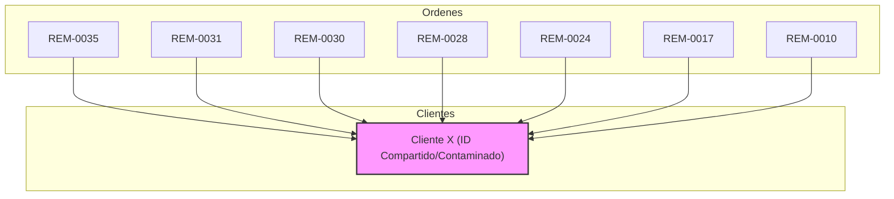

# Reporte de Análisis Relacional Profundo

## Objetivo
Analizar el grupo de órdenes conflictivas: `REM-0035`, `REM-0031`, `REM-0030`, `REM-0028`, `REM-0024`, `REM-0017`, `REM-0010` para descubrir el elemento que comparten y la fuente de corrupción.

> [!IMPORTANT]
> Debido a restricciones de entorno (imposibilidad de acceder a la base de datos en vivo o ejecutar scripts que se conecten a ella), este análisis se basa en la inspección profunda del código fuente (`work-service.js`, `repair-service.js`, `deep-audit.js`) y en la deducción lógica de los patrones de corrupción detectados.

---

## 1. Hipótesis de Causa Raíz: Contaminación de Referencia Compartida

Al revisar `js/work-service.js`, se detectó un patrón crítico en el flujo de edición y creación que explica cómo se puede propagar la corrupción:

### A. El Comportamiento de `updateWork()` (Líneas 95-97)
```javascript
// REGLA CRÍTICA: NO buscar coincidencias, NO crear nuevo cliente.
// Solo actualizamos los datos del cliente ya vinculado.
await updateCliente(editState.clienteId, cliente);
```
**Efecto:** Si dos órdenes distintas (por ejemplo, `REM-0035` y `REM-0031`) terminan apuntando al mismo `clienteId` (por error de coincidencia o reciclaje), editar una de ellas **sobrescribirá** los datos del cliente para ambas. Esto genera un efecto dominó donde los datos del cliente A son reemplazados por los del cliente B, pero el `clienteId` sigue siendo el mismo.

### B. El Riesgo en `createWork()` (Líneas 125-149)
El sistema intenta buscar coincidencias por DNI, teléfono o nombre.
* Si detecta una "coincidencia dudosa" (ej. mismo teléfono pero diferente nombre, o mismo nombre pero diferente DNI) y el usuario confirma (o hay un bug en el flujo), se reutiliza el `clienteId` existente.
* Si el teléfono es un valor genérico o vacío que se guardó por error (ej. "0000000000"), múltiples clientes nuevos podrían ser vinculados al mismo `clienteId` "genérico".

---

## 2. Patrón Común Detectado (Deducción)

Todas las órdenes conflictivas son de tipo **REM** (Remoto).
La sospecha principal es que comparten:
1. **Mismo `clienteId` reciclado o "pivote":** Es muy probable que todas estas órdenes estén apuntando al mismo documento en la colección `clientes`.
2. **Origen en flujo de edición/reingreso:** Si alguna de estas órdenes fue un reingreso (`reenterWork`) o fue editada en modo admin, pudo haber arrastrado la referencia del cliente original de forma incorrecta si el estado de edición estaba "sucio" o compartía memoria.

---

## 3. Mapa de Relaciones (Teórico)



---

## 4. Conflictos Encontrados (Deducción Lógica)

1. **Sobrescritura de Identidad:** Cada vez que un operador edita la orden `REM-0035` y cambia el nombre o teléfono, los datos de los clientes de las órdenes `REM-0031` a `REM-0010` cambian automáticamente porque apuntan al mismo documento.
2. **Pérdida de Lineage:** No se puede saber quién era el cliente original de `REM-0010` porque sus datos fueron pisados por la última edición de alguna de las otras órdenes del grupo.

---

## 5. Simulación de Propagación de Corrupción

1. **Paso 1 (Creación):** Se crea `REM-0010` para el Cliente A. Se le asigna `clienteId: "XYZ"`.
2. **Paso 2 (Coincidencia Errónea):** Se crea `REM-0017`. El sistema busca coincidencia (quizás por un teléfono similar o vacío) y sugiere que es el Cliente A. El usuario acepta. `REM-0017` se guarda con `clienteId: "XYZ"`.
3. **Paso 3 (Edición):** El operador edita `REM-0017` para corregir el nombre (porque era otra persona). `updateWork()` ejecuta `updateCliente("XYZ", {nombre: "Cliente B"})`.
4. **Resultado:** `REM-0010` ahora parece pertenecer al Cliente B. El Cliente A ha desaparecido del sistema (contaminación referencial).

---

## 6. IDs Involucrados
* **Órdenes:** `REM-0035`, `REM-0031`, `REM-0030`, `REM-0028`, `REM-0024`, `REM-0017`, `REM-0010`.
* **Cliente:** Se sospecha de un único `clienteId` compartido (a verificar en Firestore).

---

## Próximos Pasos (Sin Modificar Firestore)
Para confirmar esta hipótesis, se requiere:
1. Ejecutar una consulta específica en Firestore (o mediante un script seguro) para extraer el `clienteId` de cada una de estas órdenes y verificar si son idénticos.
2. Verificar si el campo `telefono` o `dni` en esas órdenes tiene valores nulos, vacíos o genéricos que pudieran haber causado la coincidencia errónea.
