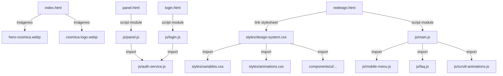

# Auditoría de Referencias de Assets y Recursos Estáticos

## 1. Recursos Detectados en Uso

### Archivos HTML Activos
- **`index.html`**: Landing page principal (Usa estilos y scripts mayormente inline).
- **`panel.html`**: Panel de control del sistema (Usa scripts inline y referencia a `js/panel.js`).
- **`login.html`**: Página de acceso (Referencia a `js/login.js`).
- **`asistencia.html`**: Página de soporte (Referencia a imágenes de AnyDesk).
- **`redesign.html`**: Prototipo de rediseño (Referencia a `styles/design-system.css` y `js/main.js`).
- **`pc-lenta-*.html`** (Múltiples archivos): Páginas de aterrizaje para SEO.

### Imágenes Utilizadas
- **`hero-cosmica.webp`**: Imagen principal en `index.html` y páginas SEO.
- **`cosmica-logo.webp`**: Logo en el header de `index.html` y páginas SEO.
- **`cosmica-logo.png`**: Usado como icono en `manifest.json`.
- **`preview.jpg`**: Imagen para previsualización en redes sociales (Open Graph) en `index.html` y páginas SEO.
- **`apple-touch-icon.png`**: Icono para dispositivos Apple en `index.html`.
- **`anydesk-logo.png`** y **`anydesk-id-ejemplo.png`**: Usados en `asistencia.html`.
- **`hero_robot.png`**: Usado únicamente en `redesign.html`.

### CSS Utilizado
- **Estilos Inline**: Tanto `index.html` como `panel.html` contienen bloques extensos de CSS `<style>` embebidos directamente en el archivo.
- **Sistema de Diseño**: `redesign.html` utiliza `styles/design-system.css`, el cual actúa como un indexador que importa mediante `@import` todos los archivos CSS individuales de `components/ui/` y `styles/`.

### Scripts JS Utilizados
- **Scripts Inline**: `index.html` y `panel.html` contienen lógica JS embebida para el manejo de la UI y funcionalidades específicas.
- **Módulos JS**:
  - `login.html` carga `js/login.js`, el cual importa `js/auth-service.js`.
  - `panel.html` carga `js/panel.js`, el cual también importa `js/auth-service.js`.
  - `redesign.html` carga `js/main.js`, el cual importa `mobile-menu.js`, `faq.js` y `scroll-animations.js`.

## 2. Hallazgos (Archivos Huérfanos y Riesgos)

### Archivos Huérfanos / Assets sin Uso
- **`cliente1.jpg`**, **`cliente2.jpg`**, **`cliente3.jpg`**: Solo se encuentran referenciados en `indexold1.html` (archivo histórico). No se usan en la landing activa.
- **`icon-512.png`**: No se encuentra referenciado en ningún archivo del proyecto (el `manifest.json` usa `cosmica-logo.png` para el tamaño 512x512).

### Referencias Rotas
- No se detectaron referencias rotas evidentes (404) hacia archivos locales que falten en el repositorio. Todas las imágenes y scripts referenciados en los archivos activos existen.

### Rutas Relativas Peligrosas
- En `styles/design-system.css`, se utilizan rutas relativas como `@import url('../components/ui/Button.css');`. Si se decide mover la carpeta `styles` o `components` en la migración hacia el nuevo sistema SaaS, estas referencias se romperán.

## 3. Mapa de Dependencias Simples

